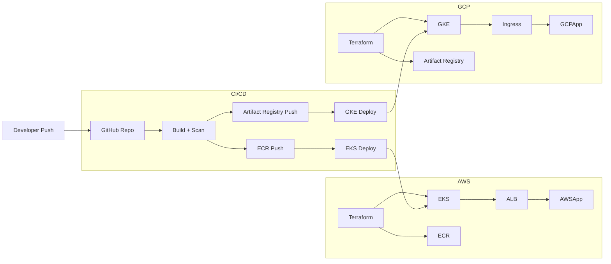

# 🚀 Multi-Cloud DevSecOps Platform (AWS EKS + GCP GKE)

A production-grade, enterprise-style DevSecOps platform demonstrating **multi-cloud Kubernetes deployment**, secure CI/CD, and Infrastructure as Code using Terraform.

---

## 🌐 Overview

This project provisions and deploys a containerized application to:

* **Amazon EKS (AWS)**
* **Google Kubernetes Engine (GCP)**

Using:

* Terraform (IaC)
* GitHub Actions (CI/CD)
* Docker (containerization)
* Helm (Kubernetes packaging)
* Secure identity (OIDC + Workload Identity Federation)

---

## 🏗️ Architecture



---

## ⚙️ Tech Stack

* AWS (EKS, ECR, IAM, S3, DynamoDB, KMS)
* GCP (GKE, Artifact Registry, IAM)
* Terraform
* GitHub Actions
* Docker
* Helm
* Kubernetes
* Trivy

---

## 📁 Repository Structure

```bash
secure-eks-platform/
├── app/
├── helm/
├── terraform/
├── gcp/
├── scripts/
├── .github/workflows/
├── Makefile
└── README.md
```

---

## 🚀 Deployment

### AWS

```bash
make aws-all
```

### GCP

```bash
make gcp-all
```

---

## 🔍 Verification

### Connect to Cluster

#### AWS

```bash
aws eks update-kubeconfig --region us-east-1 --name <cluster>
kubectl get nodes
```

#### GCP

```bash
gcloud container clusters get-credentials mission-status-gke \
  --zone us-east1-c \
  --project mission-status-api
kubectl get nodes
```

---

### Verify Workloads

```bash
kubectl get pods -n mission-status
kubectl get svc -n mission-status
```

---

### Verify Ingress

```bash
kubectl get ingress -n mission-status
```

---

### Test Application

```bash
curl https://app.kanedata.net/health
```

---

## 🧹 Teardown

### AWS

```bash
make aws-teardown
```

### GCP

```bash
make gcp-teardown
```

---

## 🔐 Security Highlights

* No static credentials (OIDC + WIF)
* KMS encryption (S3 + DynamoDB)
* Trivy vulnerability scanning
* Least privilege IAM

---

## 💡 Key Capabilities

* Multi-cloud deployment (AWS + GCP)
* Secure CI/CD pipelines
* Infrastructure as Code
* Kubernetes production deployment
* Automated teardown

---

## 📌 Next Enhancements

* Monitoring (Prometheus / Grafana)
* Logging (ELK / Cloud Logging)
* Autoscaling (HPA)
* Canary deployments

---

## 👨‍💻 Author

Aniekan Essiet

